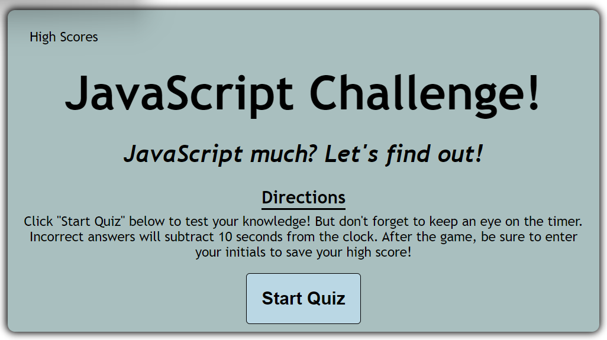

# JavaScript Challenge! Quiz

## Description

This is a quiz to test your knowledge on some of the basics of JavaScript. This program consists of a custom-built GUI using HTML, CSS, and JavaScript.

### Features
* 23 questions to test your knowledge
* 90 second timer to make things competitive
* Visual feedback as to whether the selected answer is correct or incorrect
* A high score leaderboard featuring up to the top five highest scores.
* A little something extra. Can you find it?

## Credits
* Questions used were obtained from the JavaScript quiz hosted at <a href="https://www.w3schools.com/js/js_quiz.asp">W3 Schools</a>
* Took inspiration for the card layout and the question array from <a href = "https://www.youtube.com/watch?v=riDzcEQbX6k">Web Dev Simplified</a>
* Learned how to sort an array of objects by object value in descending order from <a href = "https://stackoverflow.com/questions/979256/sorting-an-array-of-objects-by-property-values">stackoverflow.com</a>

## Link to deployed application
<a href = "https://github.com/mjzabriskie/javascript-challenge-quiz">https://github.com/mjzabriskie/javascript-challenge-quiz</a>

## Screenshot
